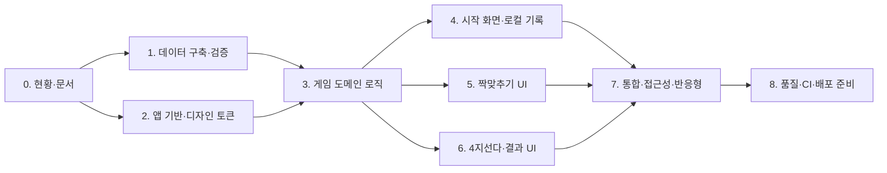

# 한자랑 구현 계획서

> 기준일: 2026-07-11
> 상태: 착수 기준안 — 구현 결과에 따라 갱신

## 1. 계획 원칙

- 데이터 신뢰성과 자동 검증을 게임 완성 선언의 선행 조건으로 둔다.
- Sites가 제공한 vinext/Vite/Cloudflare 구조를 유지하고 정적 클라이언트 기능만 추가한다.
- 게임 규칙을 먼저 순수 함수로 만들고, 그 위에 접근 가능한 UI를 연결한다.
- 각 단계는 코드 작성뿐 아니라 테스트·문서 동기화까지 완료해야 다음 단계의 완료로 본다.
- 사용자 변경과 원본 `design.md`를 보존하며, 불필요한 백엔드·인증·상태 라이브러리를 추가하지 않는다.

## 2. 단계 및 의존 관계

데이터 구축과 앱 기반 작업은 병렬로 진행할 수 있다. 게임 도메인은 검증된 스키마와 타입 계약이 확정된 뒤 통합한다. UI 두 모드는 공통 로직 이후 병렬 구현이 가능하나, 최종 기록 저장과 화면 전환은 한 번에 통합 검증한다.

## 3. 단계별 실행 계획

### 0단계 — 현황 조사와 기준 문서

작업:

- `startPrompt.txt`, `project_prompt.md`, `design.md` 요구사항 비교
- Git 상태, Sites starter, 잠금 파일, 빌드 구성 확인
- PRD, TRD, 본 계획, 작업 목록, 디자인 시스템 초안 작성
- 데이터 원문의 등급 구간과 신습자 수 확인

중요 결정:

- 원문 기준 수량 `7급 50 / 준6급 75 / 6급 75`를 사용한다.
- 앱은 `/` 한 화면의 상태 전환으로 만들고 D1/R2를 사용하지 않는다.
- 짝맞추기는 6쌍, 퀴즈는 최대 10문제를 기본 단위로 한다.

검증:

- 문서 간 링크와 용어 일치
- 원본 `design.md` 무변경 확인
- [TASKS.md](./TASKS.md)에 구현 항목이 미완료로 등록됐는지 확인

완료 조건: 구현자가 질문 없이 데이터·화면·상태 계약을 시작할 수 있다.

### 1단계 — 한자 데이터 수집, 정규화, 검증

선행 조건: 0단계의 데이터 타입 합의.

작업:

- 원문에서 대상 구간의 한자와 훈음을 수집해 정적 JSON으로 저장
- `eum`/`hun` 대응 배열, 대표 `eumhun`, 원문 `sourceLabel`, 출처 URL 구성
- 등급 순서 기반 안정 ID 부여
- 200자, `50/75/75`, 중복, 필수값, Unicode, 원문 보존 검증
- 퀴즈 보기 충돌과 복수 정답 위험을 검사하는 자동 검증 추가
- 수집 시점과 예외를 [DATA_SPEC.md](./DATA_SPEC.md)에 기록

검증:

- 데이터 검증 명령과 단위 테스트 실행
- 등급별 첫/마지막 항목 표본을 원문과 대조
- 복수 훈음 항목은 배열 인덱스와 `sourceLabel`을 수동 대조

완료 조건: 검증 명령이 200자와 모든 스키마 규칙을 통과하고 문서에 결과가 기록된다.

### 2단계 — Sites 앱 기반과 디자인 토큰

선행 조건: 0단계 완료. 1단계와 병렬 가능.

작업:

- starter 스켈레톤을 제품 진입 화면으로 교체
- `layout.tsx`를 한국어 문서, 제품 제목·설명·아이콘으로 갱신
- `globals.css`에 [DESIGN_SYSTEM.md](./DESIGN_SYSTEM.md)의 색상·간격·타입·모서리·포커스 토큰 구현
- 앱 셸, 버튼, 범위 선택, 진행 표시, 피드백, 빈/오류/완료 패널의 공통 스타일 작성
- 사용하지 않는 preview import·파일·의존성과 임시 메타데이터 제거
- 밝은 테마를 명시하고 외부 웹 폰트·대형 이미지 의존성을 피함

검증:

- 320px에서 가로 스크롤 없이 시작 화면 렌더
- 모든 조작 영역 44×44px 이상
- 색 대비와 `:focus-visible` 상태 점검
- `npm run build`로 vinext/Cloudflare 호환 확인

완료 조건: 실제 데이터 없이도 공통 상태를 표현하는 반응형 제품 셸이 빌드된다.

### 3단계 — 데이터 접근과 게임 도메인 로직

선행 조건: 1단계 데이터 계약, 2단계 TypeScript 기반.

작업:

- `HanjaGrade`, `GradeFilter`, `HanjaEntry`와 게임 상태 타입 정의
- 등급 필터와 주입 가능한 Fisher–Yates 셔플 구현
- 6쌍 라운드 생성과 카드 선택 상태 전이 구현
- 최대 10문제 세트, 고유 보기, 모호한 음훈 배제, 채점 로직 구현
- 오류를 반환하는 생성 결과 타입을 정의해 UI가 빈 배열을 정상 세트로 오인하지 않게 함

검증:

- 고정 RNG를 이용한 결정적 단위 테스트
- 빠른 세 번째 입력, 동일 카드, 이미 맞춘 카드, 동일 종류 카드 테스트
- 모든 등급의 전체 항목을 정답 후보로 돌려 보기 4개·정답 1개 불변식 검사

완료 조건: React 없이 두 게임의 한 세트를 끝까지 시뮬레이션하는 테스트가 통과한다.

### 4단계 — 시작 화면과 로컬 기록

선행 조건: 2·3단계.

작업:

- 등급 선택과 실제 데이터 수 표시
- 두 학습 모드 설명과 시작 동작 구현
- 버전 1 저장 스키마, 안전한 읽기·검증·쓰기 구현
- 마지막 범위, 모드별 완료 횟수, 최근 퀴즈 결과 표시
- 저장소 사용 불가·손상·미래 버전 데이터에 대한 기본값 복구 구현
- 진행 중 게임은 저장하지 않고 새로고침 시 홈으로 복귀하도록 명시

검증:

- 등급 변경에 따른 `50/75/75/200` 표시
- 정상·잘못된 JSON·잘못된 필드·저장 예외 테스트
- 서버 렌더와 첫 클라이언트 렌더 간 hydration 경고 확인

완료 조건: 새 사용자와 재방문 사용자가 모두 게임을 시작할 수 있고 저장 실패가 앱을 막지 않는다.

### 5단계 — 짝맞추기 경험

선행 조건: 3·4단계.

작업:

- 12장 카드 그리드와 가림/공개/맞춤 상태 구현
- 비교 중 입력 잠금과 불일치 확인 지연 구현
- 맞춘 쌍, 시도 횟수, 진행 텍스트·진행 막대 구현
- 완료 패널과 다시 하기·새 카드·다른 모드·홈 동작 연결
- 뒷면 카드의 접근 가능한 이름에서 정답을 숨기고 포커스 흐름 보정
- 감소된 모션에서 3D 회전 제거

검증:

- 키보드만으로 완료
- 연속 클릭과 화면 이탈 중 타이머 정리
- 한자와 긴 음훈 카드가 320px에서 잘리지 않는지 확인

완료 조건: 모든 쌍을 정확히 맞출 수 있고 상태 오류나 정답 누설이 없다.

### 6단계 — 4지선다와 결과·복습

선행 조건: 3·4단계. 5단계와 병렬 가능.

작업:

- 큰 한자 문제, 보기 네 개, 현재/전체, 정답 수 표시
- 1회 응답 잠금, 정답·오답 상태, 대표 음훈 재표시
- 명시적 다음 문제와 마지막 문제 결과 전환
- 점수, 정답률, 오답 한자·음훈 목록 구현
- 같은 문제 다시 풀기와 새 문제 풀기 의미를 분리
- 최근 점수 요약을 최대 10회 기록에 저장하고 오답 목록은 현재 결과 세션에서 표시

검증:

- 보기 역할·이름 기반 상호작용 테스트
- 정답과 오답 각각의 문구·기호·테두리 확인
- 마지막 문제 중복 채점 방지와 만점/오답 있음 결과 분기

완료 조건: 중복·모호한 보기 없이 한 세트를 완료하고 복습 목록이 답안과 일치한다.

### 7단계 — 통합, 접근성, 반응형

선행 조건: 4~6단계.

작업:

- 홈↔두 게임↔결과 교차 이동과 범위 유지 통합
- 로딩·빈 데이터·오류·완료 문구 통합
- 제목 구조, 랜드마크, 라이브 영역, 포커스 이동 검토
- 모바일·태블릿·데스크톱 카드/보기 그리드 조정
- 200% 확대, 긴 음훈, 한자 글꼴 fallback, 고대비 점검
- `prefers-reduced-motion`과 터치·키보드 동작 점검

검증:

- [PRD.md](./PRD.md)의 수용 기준을 사용자 흐름 체크리스트로 실행
- 320px, 768px, 1280px 대표 너비 점검
- 키보드 전용으로 두 게임 완주
- 가능한 자동 접근성 검사와 수동 이름·상태 점검

완료 조건: 지원 환경에서 핵심 흐름을 내용 손실 없이 완료한다.

### 8단계 — 품질, 문서, CI, 배포 준비

선행 조건: 1~7단계.

작업:

- lint, typecheck, test, build 스크립트 확정
- rendered HTML 스모크 테스트를 제품 제목과 콘텐츠에 맞게 갱신
- README의 설치·실행·검증·데이터 출처·구조 갱신
- PRD/TRD/TASKS/DESIGN_SYSTEM/DATA_SPEC를 실제 구현과 동기화
- GitHub Actions에서 `npm ci → lint → typecheck → test → build` 실행
- 기존 원격 이력을 확인한 뒤 안전한 커밋과 푸시 수행
- 배포 대상 빌드를 검증하고 Sites 호스팅 단계로 인계

검증:

- 깨끗한 의존성 설치 기준 전체 품질 명령 재실행
- starter 문구, preview 메타데이터, 불필요한 의존성 검색
- Git diff와 원격 브랜치 상태 확인

완료 조건: CI와 로컬 검증이 성공하고 문서가 실제 동작을 과장 없이 설명한다.

## 4. 검증 매트릭스

| 대상 | 자동 검증 | 수동 검증 |
|---|---|---|
| 데이터 | 스키마·수량·중복·보기 불변식 | 원문 표본·복수 훈음 대조 |
| 짝맞추기 | 상태 전이·잠금·완료 테스트 | 키보드, 빠른 입력, 모바일 가독성 |
| 4지선다 | 고유 보기·채점·결과 테스트 | 피드백 이해도, 긴 문구 줄바꿈 |
| 저장 | 파싱·검증·예외 테스트 | 새로고침, 차단된 저장소 환경 |
| 접근성 | 역할 기반 테스트·가능한 자동 검사 | 포커스 순서, 색 외 상태, 200% 확대 |
| 반응형 | 스타일/렌더 스모크 | 320/768/1280px 실제 화면 |
| 배포 | lint·typecheck·test·build·CI | 배포 URL의 첫 로드와 새로고침 |

## 5. 주요 위험과 대응

| 위험 | 영향 | 대응 |
|---|---|---|
| 원문 수량이 초기 예상과 다름 | 잘못된 등급 범위 | 원문 `50/75/75`를 데이터·문서·테스트의 단일 기준으로 사용 |
| 복수·유사 음훈 | 복수 정답처럼 보이는 보기 | 원문 전체 보존, 대표값 분리, 대체 음훈 집합 충돌 후보 제외 |
| 빠른 카드 입력 | 세 번째 카드 공개·중복 점수 | `checking` 단계 잠금, 순수 전이 테스트, 타이머 정리 |
| 서버/클라이언트 값 차이 | hydration 경고·화면 깜빡임 | 마운트 전 기본값, 이후 저장 복원, 서버에서 `window` 미접근 |
| 작은 화면의 12장 밀도 | 읽기 어려운 카드 | 모바일 3열 중심, 44px 이상, 6쌍 고정, 긴 음훈 줄바꿈 |
| 외부 폰트·이미지 | 느린 첫 로드·개인정보 요청 | 시스템 글꼴과 CSS 장식만 사용 |
| 저장소 손상·용량 제한 | 앱 진입 실패 | 스키마 검증, 예외 포착, 최근 10회 제한, 세션 계속 |
| starter 구조 과도한 변경 | Sites 빌드 실패 | vinext/sites/Cloudflare 플러그인 보존, 단계마다 build |

## 6. 변경 관리

- 제품 요구가 바뀌면 먼저 [PRD.md](./PRD.md)의 요구 ID와 수용 기준을 수정한다.
- 타입·저장·라우팅 계약이 바뀌면 [TRD.md](./TRD.md)와 관련 테스트를 같은 변경으로 갱신한다.
- 색상·크기·상태 표현이 바뀌면 CSS 토큰과 [DESIGN_SYSTEM.md](./DESIGN_SYSTEM.md)를 함께 갱신한다.
- 완료된 작업만 [TASKS.md](./TASKS.md)에 체크한다. 실행하지 않은 테스트나 배포를 완료로 표시하지 않는다.
- 데이터 변경은 [DATA_SPEC.md](./DATA_SPEC.md)의 출처·수량·예외·검증 결과를 먼저 갱신한다.
